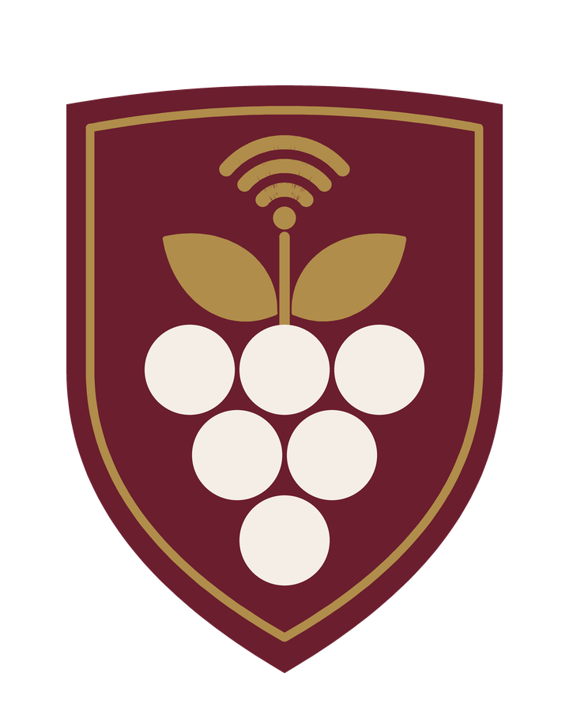
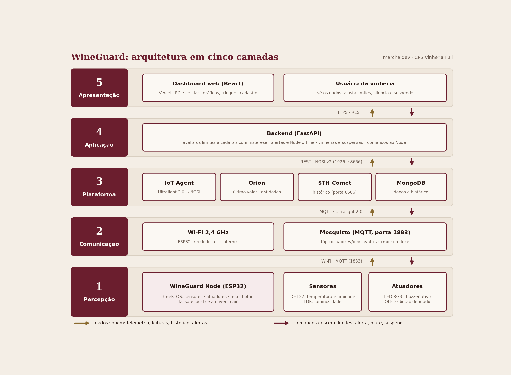
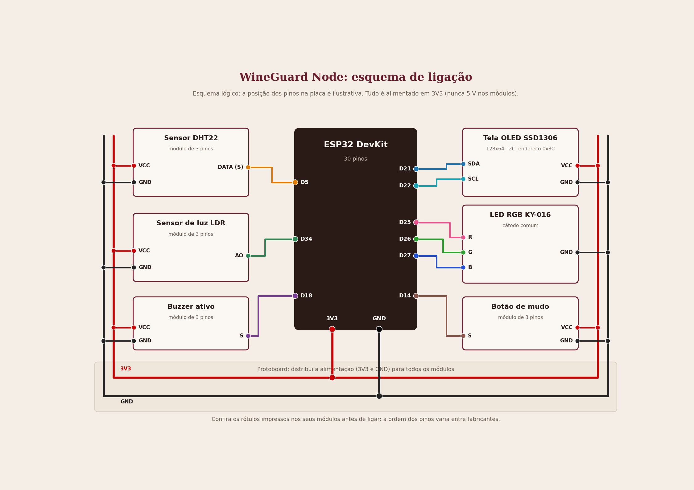

<p align="center">
  
</p>

<h1 align="center">WineGuard</h1>
<p align="center"><em>Cada garrafa no ponto certo.</em></p>

Monitoramento de adegas de vinho com **IoT**: um dispositivo com ESP32 vigia temperatura, umidade e luminosidade, avisa na hora por **LED,
buzzer e tela** quando algo sai do ponto, e envia os dados para uma plataforma **FIWARE**. Um **dashboard web** mostra tudo em tempo real,
em gráficos, e deixa cadastrar dispositivos, ajustar os limites e gerenciar várias vinherias.

Projeto do grupo **marcha.dev** para o **CP5 Vinheria Full**. Base: *FIWARE Smart Lamp* e *FIWARE Descomplicado*, do Prof. Fábio H. Cabrini.

## Sumário

1. [O problema](#o-problema) · 2. [A solução](#a-solução) · 3. [Status do projeto](#status-do-projeto) · 4. [Demonstração](#demonstração)
5. [Arquitetura](#arquitetura-em-cinco-camadas) · 6. [Várias vinherias](#várias-vinherias) · 7. [O Node (hardware)](#o-wineguard-node-hardware)
8. [Alertas](#como-o-node-avisa) · 9. [Protocolo](#protocolo-mqtt) · 10. [Plataforma FIWARE](#plataforma-fiware) · 11. [Dashboard](#dashboard)
12. [Referências de guarda](#referências-de-guarda) · 13. [Como rodar](#como-rodar) · 14. [Estrutura do repositório](#estrutura-do-repositório)
15. [Limitações e evolução](#limitações-e-evolução) · 16. [Créditos](#créditos) · 17. [Equipe](#equipe)

## O problema

Vinho guardado em condições erradas estraga, e quase sempre ninguém percebe a tempo. Segundo especialistas e fabricantes de adegas:

- **Temperatura:** o calor acelera o envelhecimento. E o que mais prejudica não é só o valor, é a temperatura que sobe e desce.
- **Umidade:** muito baixa resseca as rolhas; muito alta danifica rótulos e caixas.
- **Luz:** luz forte altera a cor e o sabor, principalmente em espumantes e garrafas de vidro claro.

Uma adega comum não avisa ninguém quando isso acontece, e a pessoa só descobre quando o vinho já foi perdido.

## A solução

| Parte | O que é |
|---|---|
| **WineGuard Node** | ESP32 com sensores (DHT22 e LDR) e avisos (LED RGB, buzzer e tela OLED), numa caixa impressa em 3D. Um por adega |
| **Plataforma (FIWARE)** | Recebe as leituras por MQTT, guarda o último valor (Orion) e o histórico (STH-Comet) e leva os comandos de volta ao Node |
| **Backend (FastAPI)** | Confere os limites de cada adega, abre e fecha alertas, cuida de vinherias e da suspensão |
| **Dashboard (React)** | Gráficos em tempo real, cadastro de dispositivos, limites (triggers), histórico de alertas e vinherias |

Se a nuvem cair, o Node **continua alertando** sozinho, com os limites guardados na memória.

## Status do projeto

Atualizado em 06/10/2026. Este README descreve só o que existe; o que ainda está em construção está marcado.

| Parte | Estado |
|---|---|
| Node: hardware e firmware 2.3 | **Pronto e testado na bancada** (sem nuvem) e no Wokwi |
| Plataforma FIWARE na AWS | **Provada**: dados e histórico chegam; o comando `mute` chega ao Node (testado com o Wokwi) |
| Cadastro de dispositivo (`provisionar.sh`) | **Pronto** |
| Dashboard (front-end) | **Rodando com dados de demonstração**. Falta ligar ao backend e publicar na Vercel |
| Backend (FastAPI) | **Em construção** |
| Docker Compose, DuckDNS e HTTPS | **Em construção** |
| Caixa 3D | Modelada; **impressão em andamento** |
| Manuais em PDF, vídeo | **A fazer** |

## Demonstração

- **Simulação no Wokwi:** https://wokwi.com/projects/476972184977904641
- **Dashboard publicado:** _(em breve)_
- **Vídeo:** _(em breve, veja `video/link.md`)_
- **Fotos do Node montado:** _(em breve)_

## Arquitetura em cinco camadas



| Camada | O que tem | Tecnologia |
|---|---|---|
| 1. Percepção | WineGuard Node: DHT22, LDR, LED RGB, buzzer ativo, OLED e botão de mudo | ESP32, Arduino (FreeRTOS) |
| 2. Comunicação | Wi-Fi 2,4 GHz e broker MQTT (porta 1883) | MQTT, Mosquitto, protocolo Ultralight 2.0 |
| 3. Plataforma | IoT Agent, Orion (último valor), STH-Comet (histórico) e MongoDB | FIWARE, Docker, AWS |
| 4. Aplicação | Avalia os limites a cada 5 s, alertas, vinherias, comandos | FastAPI (Python) |
| 5. Apresentação | Dashboard para computador e celular | React, Vite, Tailwind, Recharts, Vercel |

Os dados **sobem** (telemetria, histórico, alertas) e os comandos **descem** (limites, alerta, mute, suspend) pelo mesmo caminho.

## Várias vinherias

A plataforma separa os dados de cada cliente com o recurso de *multi-tenancy* do FIWARE:

| Conceito | No FIWARE |
|---|---|
| Vinheria | `fiware-service` (ex.: `vin_demo`) |
| Adega | `fiware-servicepath` (ex.: `/adega1`) |
| Node | `device_id` (ex.: `wgn001`) e `apikey` da vinheria |
| Entidade no Orion | `urn:ngsi-ld:WineGuardNode:001` |

Cada vinheria tem **nome, vencimento e status** (ativa ou suspensa). Ao suspender, os Nodes apagam LED e buzzer, param de enviar
dados e o painel mostra o aviso de serviço suspenso. O histórico é preservado.

## O WineGuard Node (hardware)



| Componente | Função | Pino do ESP32 |
|---|---|---|
| DHT22 (módulo de 3 pinos) | Temperatura e umidade | D5 |
| LDR (módulo de 3 pinos) | Luminosidade (em % relativa) | D34 |
| Buzzer ativo (módulo de 3 pinos) | Alerta sonoro | D18 |
| LED RGB KY-016 | Alerta visual: vermelho, verde e azul | D25, D26, D27 |
| OLED SSD1306 128x64 (I2C) | Valores, alertas e estado | D21 (SDA), D22 (SCL) |
| Botão de mudo (módulo de 3 pinos) | Silencia o buzzer | D14 |

Montagem sem solda, com um protoboard como distribuidor de 3V3 e GND e a caixa impressa em 3D (PLA, tampa removível por parafusos).
Detalhes em [`hardware/esquema-ligacao.md`](hardware/esquema-ligacao.md) e [`hardware/lista-de-materiais.md`](hardware/lista-de-materiais.md).

## Como o Node avisa

A **cor do LED** e a **tela** dizem qual variável. O **LED** e o **som** dizem o sentido:

| | LED | Buzzer | Tela |
|---|---|---|---|
| **ALTA** (acima do limite) | Fixo na cor da variável | 1 bipe longo repetido | "ALTA", valor e limite máximo |
| **BAIXA** (abaixo do limite) | Pisca junto com o som | 2 bipes e uma pausa | "BAIXA", valor e limite mínimo |

Cores: **vermelho** = temperatura, **azul** = umidade, **verde** = luminosidade (as mesmas dos gráficos do dashboard).
Com mais de uma variável em alerta, o Node alterna entre elas, com uma pausa de silêncio. O botão silencia só o buzzer; o LED continua.
Se o Node perder a conexão por mais de 15 s, avalia os limites sozinho. Detalhes do firmware em [`hardware/firmware/README.md`](hardware/firmware/README.md).

## Protocolo (MQTT)

Ultralight 2.0 sobre MQTT, no padrão do *FIWARE Descomplicado*:

| Tópico | Sentido | Conteúdo |
|---|---|---|
| `/<API_KEY>/<DEVICE_ID>/attrs` | Node para a nuvem | Telemetria |
| `/<API_KEY>/<DEVICE_ID>/cmd` | Nuvem para o Node | Comandos |
| `/<API_KEY>/<DEVICE_ID>/cmdexe` | Node para a nuvem | Resposta do comando |

```
Telemetria  t|24.5|h|60.0|l|35|st|ok|mu|0|rs|-60|fw|2.3
            temperatura, umidade, luz (%), estado, mudo, sinal Wi-Fi, versão do firmware

Comandos    <DEVICE_ID>@<comando>|<parametros>
            setTriggers|tmin,tmax,hmin,hmax,lmin,lmax     alert|<t|h|l>,<high|low>,<1|0>
            mute|<1|0>   suspend|   resume|   setInterval|<segundos>   identify|
```

No Orion, os atributos viram `temperature`, `humidity`, `luminosity`, `state`, `muted`, `rssi` e `firmware`.

## Plataforma FIWARE

Roda em Docker numa instância da AWS (Learner Lab) e usa a base do professor: Mosquitto, IoT Agent (Ultralight), Orion, STH-Comet e dois MongoDB.
O script [`fiware/scripts/provisionar.sh`](fiware/scripts/provisionar.sh) cadastra uma vinheria (*service*), o dispositivo e a assinatura que
manda o histórico para o STH-Comet.

> **Lição aprendida:** o dispositivo precisa ser cadastrado **com a `apikey`**. Sem ela, o IoT Agent não reconhece o cadastro, cria um
> dispositivo novo sozinho (sem o mapeamento `t` para `temperature`) e as leituras vão para a entidade errada. O script já faz certo.

## Dashboard

Front-end em React (Vite, React Router, Tailwind e Recharts), para computador e celular.

| Tela | O que faz |
|---|---|
| Início | O problema, a solução e a equipe |
| Painel | Um dispositivo por vez, com os outros em chips. Valores de agora, 4 gráficos (temperatura, umidade, luz e combinado), estabilidade de 24 h, atualização a cada 5 s |
| Dispositivos | Cadastrar, editar e remover; mostra o bloco de configuração (`config.h`) do Node |
| Triggers | Limites por preset de guarda ou personalizados, avisos quando fogem da referência, calibração da luz |
| Alertas | Histórico com início, fim e duração, e filtros |
| Vinherias | Cadastro, vencimento, suspender e reativar |
| Suspenso | Aviso quando a vinheria está suspensa |

O formato dos dados entre o dashboard e o backend está definido em [`docs/api-contrato.md`](docs/api-contrato.md).
Enquanto o backend não existe, o dashboard usa **dados de demonstração** gerados no navegador, com um simulador de sensores.

## Referências de guarda

Os limites vêm de recomendações de especialistas e de fabricantes de adegas (Decanter, Jancis Robinson, EuroCave, Nicolas Feuillatte e
Forbes Brasil). **Não são uma norma oficial**: os limites de alerta são uma adaptação do grupo.

| Preset | Temperatura | Umidade | Luz máx. |
|---|---|---|---|
| Guarda geral (tinto, branco e rosé) | 10 a 15 °C | 60 a 75 % | 10 % |
| Longa guarda | 11 a 14 °C | 65 a 75 % | 5 % |
| Espumante | 9 a 13 °C | 65 a 80 % | 5 % |

São presets de **guarda**, não de servir. Fontes e detalhes em [`docs/referencias.md`](docs/referencias.md).

## Como rodar

### 1. Ver a simulação (Wokwi)

Abra https://wokwi.com/projects/476972184977904641 e clique em Play. Mexa no controle de lux do LDR e na temperatura e umidade do DHT22
para disparar os alertas. Detalhes em [`simulacao/wokwi.md`](simulacao/wokwi.md).

### 2. Montar e gravar o Node

1. Monte o circuito pelo [`esquema de ligação`](hardware/esquema-ligacao.md).
2. Instale a Arduino IDE, o pacote **esp32** e as bibliotecas (lista em [`hardware/firmware/README.md`](hardware/firmware/README.md)).
3. Em `hardware/firmware/wineguard_node/`, copie `config.example.h` para `config.h` e preencha (`SIMULACAO_WOKWI 0` na bancada).
4. Grave na placa **ESP32 Dev Module** e abra o monitor serial a 115200.

Sem a nuvem, o Node funciona sozinho: lê os sensores e avisa com os limites do preset Guarda geral.

### 3. Plataforma FIWARE

Com a base FIWARE do professor rodando na máquina (Mosquitto, IoT Agent, Orion e STH-Comet), dentro dela:

```bash
bash fiware/scripts/provisionar.sh vin_demo /adega1 winedemo 001
```

Conferir se os dados chegam (troque `localhost` pelo endereço da máquina, se for de fora):

```bash
curl -s "http://localhost:1026/v2/entities/urn:ngsi-ld:WineGuardNode:001?type=WineGuardNode" \
  -H "fiware-service: vin_demo" -H "fiware-servicepath: /adega1"
```

No `config.h` do Node, use a mesma `API_KEY` (`winedemo`) e o `DEVICE_ID` (`wgn001`), e em `MQTT_BROKER` o endereço da máquina.
O IP da instância do Learner Lab **muda a cada sessão**.

### 4. Dashboard

_(em construção: o código entra em `frontend/`)_ A instalação será:

```bash
cd frontend
npm install
cp .env.example .env
npm run dev
```

### 5. Backend

_(em construção)_

## Estrutura do repositório

```
wineguard/
├── README.md
├── docker-compose.yml          (em construção)
├── .env.example                (em construção)
├── backend/                    (em construção) FastAPI e requirements.txt
├── docs/
│   ├── arquitetura.png         diagrama em cinco camadas
│   ├── decisoes.md             decisões do projeto
│   ├── referencias.md          referências de guarda
│   ├── api-contrato.md         formato dos dados entre dashboard e backend
│   ├── manual-instalacao.md    (em construção)
│   ├── manual-operacao.md      (em construção)
│   └── imagens/                emblema e imagens do README
├── fiware/scripts/provisionar.sh
├── frontend/                   dashboard React (o código entra aqui)
├── hardware/
│   ├── esquema-ligacao.md, esquema-ligacao.png
│   ├── lista-de-materiais.md
│   └── firmware/wineguard_node/   .ino, icones.h e config.example.h
├── simulacao/                  Wokwi (diagram.json, libraries.txt, wokwi.md)
└── video/link.md
```

## Limitações e evolução

Limitações conhecidas desta versão (é uma prova de conceito):

- **Sem autenticação.** Qualquer pessoa com o link vê e altera qualquer vinheria. A suspensão por inadimplência é uma demonstração.
- O *multi-tenant* organiza os dados, mas **não os protege** entre vinherias.
- **MQTT sem usuário, senha e TLS**; a pilha FIWARE também roda sem TLS e sem autenticação. Quem souber a `apikey` consegue publicar.
- O sensor de luz mede em **% relativa**, não em lux, e o valor varia de um módulo para outro (por isso há a calibração).
- O DHT22 tem margem de **±0,5 °C**.
- O **buzzer diferencia o sentido** (alta ou baixa), mas **não a variável**: ela é identificada pela cor do LED e pela tela. Quem não enxerga o LED nem
  a tela não distingue a variável pelo som.
- O IoT Agent **recria** dispositivos apagados enquanto o ESP32 continuar publicando.
- O IP da máquina do Learner Lab muda a cada sessão (mitigado com DuckDNS).
- As referências de guarda são recomendações, não uma norma.

Evolução prevista: login por usuário e perfis, banco relacional, MQTT com TLS, cancelamento de vinheria com carência, exportação em CSV,
WiFiManager (configurar o Wi-Fi sem regravar), um buzzer passivo para diferenciar a variável pelo tom e alertas externos.

## Créditos

- **FIWARE Descomplicado** e **FIWARE Smart Lamp**: base da plataforma e do protocolo, do Prof. Fábio H. Cabrini.
- Emblema do WineGuard: imagem de referência gerada com apoio de IA e **redesenhada em SVG** pelo grupo.
- Este projeto foi desenvolvido com apoio de assistentes de IA (Claude, da Anthropic) em planejamento, código e documentação.
  O grupo testou o que está descrito como "pronto".
- Fontes das referências de guarda em [`docs/referencias.md`](docs/referencias.md).

## Equipe

**marcha.dev**

- Enzo Pereira
- Raphael Mascarenhas
- Yannick Davila
- Alysson Souto
